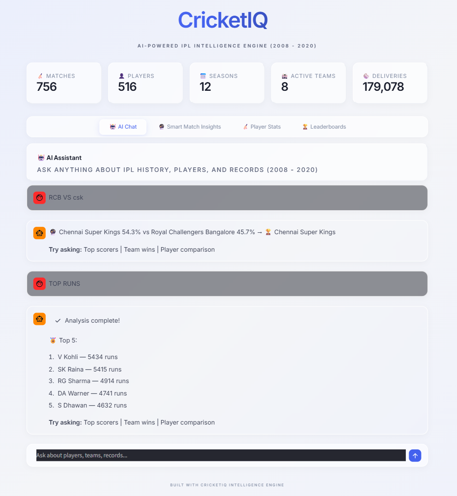
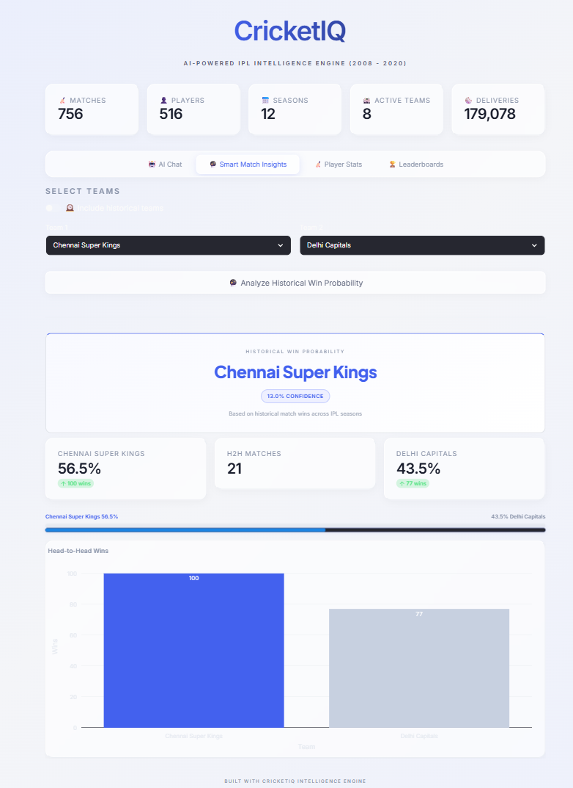
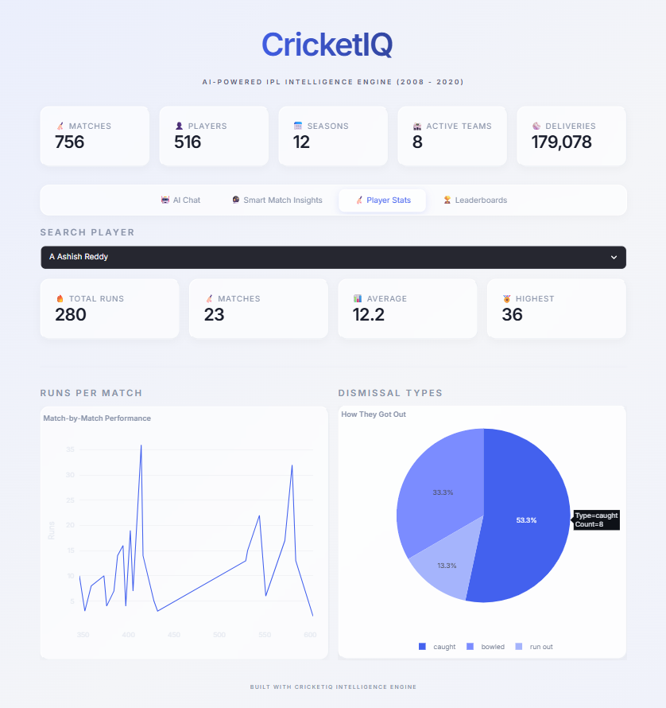
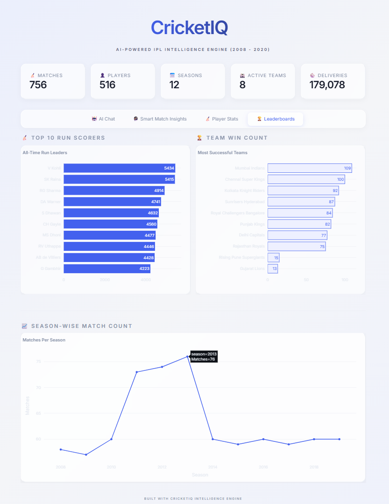

<div align="center">

# 🏏 CricketIQ

### AI-Powered IPL Intelligence Engine

[](https://python.org)
[](https://streamlit.io)
[](https://ai.google.dev)
[](LICENSE)

**Transform raw IPL data into actionable intelligence through AI-powered analytics.**

CricketIQ is a production-grade, AI-driven dashboard that delivers instant statistics, match predictions, and player performance metrics across 12+ years of IPL history — all through an intuitive natural language chat interface powered by Google Gemini.

[Getting Started](#-quick-start) · [Features](#-features) · [Architecture](#-architecture) · [Deployment](#-deployment)

</div>

---

## 🏅 Hackathon Participation — IIT Nuzvid

<p align="center">
  
</p>

<div align="center">
**🎓 Participated in Hackathon at IIT Nuzvid**
</div>

---

## ✨ Features

| Feature | Description |
|---------|-------------|
| 🤖 **AI Chat Assistant** | Ask questions in natural language — get instant, data-backed IPL insights powered by Google Gemini 2.0 Flash |
| 🔮 **Match Predictions** | Historical win probability analysis with interactive head-to-head visualizations |
| 🏏 **Player Analytics** | Deep-dive into batting averages, match-by-match performance, and dismissal breakdowns |
| 🏆 **Leaderboards** | Top run scorers, most successful teams, and season-wise match trends |
| 🎯 **Deterministic AI** | Rule-based intent routing ensures accurate, hallucination-free responses every time |
| ⚡ **Blazing Fast** | Streamlit caching + optimized Pandas queries for sub-second response times |
| 🎨 **Premium UI** | Glassmorphism design with micro-animations, responsive across all devices |

---

## 🏗 Architecture

```
┌──────────────────────────────────────────────────────────┐
│                    STREAMLIT FRONTEND                     │
│  ┌──────────┬──────────┬──────────┬──────────────────┐   │
│  │ AI Chat  │ Predict  │ Player   │  Leaderboards    │   │
│  │   Tab    │   Tab    │   Tab    │      Tab         │   │
│  └────┬─────┴────┬─────┴────┬─────┴────────┬─────────┘   │
│       │          │          │              │              │
│  ┌────▼──────────▼──────────▼──────────────▼─────────┐   │
│  │              ANALYTICS ENGINE                      │   │
│  │  batting.py │ bowling.py │ team.py │ predictions.py│   │
│  └────────────────────┬──────────────────────────────┘   │
│                       │                                   │
│  ┌────────────────────▼──────────────────────────────┐   │
│  │    AI ENGINE (Intent Router + Gemini Formatter)    │   │
│  └────────────────────┬──────────────────────────────┘   │
│                       │                                   │
│  ┌────────────────────▼──────────────────────────────┐   │
│  │         DATA LAYER (Pandas + CSV Cache)            │   │
│  │         matches.csv  │  deliveries.csv             │   │
│  └───────────────────────────────────────────────────┘   │
└──────────────────────────────────────────────────────────┘
```

**Query Pipeline:**

```
User Query → Intent Router → Entity Extraction → Analytics Function → Raw Data → Gemini Formatting → Response
```

---

## 🛠 Tech Stack

| Technology | Purpose |
|------------|---------|
| **Python 3.10+** | Core backend logic and data processing |
| **Streamlit** | Interactive frontend dashboard framework |
| **Pandas** | High-performance data manipulation and aggregation |
| **Plotly** | Interactive, dynamic data visualizations |
| **Google Gemini 2.0 Flash** | Natural language processing and response formatting |
| **Docker** | Containerization for cloud deployment |
| **Google Cloud Run** | Serverless production hosting |

---

## 🚀 Quick Start

### Prerequisites

- Python 3.10 or higher
- A [Google Gemini API key](https://aistudio.google.com/apikey)

### 1. Clone the repository

```bash
git clone https://github.com/gowtham2thrive/CricketIQ.git
cd CricketIQ
```

### 2. Install dependencies

```bash
pip install -r requirements.txt
```

### 3. Configure environment

```bash
cp .env.example .env
```

Edit `.env` and add your Gemini API key:

```env
GEMINI_API_KEY=your_actual_api_key_here
```

### 4. Run the application

```bash
streamlit run src/app.py
```

The dashboard will open at `http://localhost:8501`

---

## 📂 Project Structure

```
CricketIQ/
│
├── src/                          # ── Source Code ──
│   ├── app.py                    # Main entry point (slim orchestrator)
│   ├── config.py                 # Constants, team mappings, aliases
│   ├── data_loader.py            # CSV loading & normalization
│   ├── styles.py                 # Global CSS design system
│   │
│   ├── analytics/                # ── Analytics Engine ──
│   │   ├── batting.py            # Player batting stats & comparisons
│   │   ├── bowling.py            # Bowler stats & economy rates
│   │   ├── team.py               # Team win rates & records
│   │   └── predictions.py        # Match predictions & top scorers
│   │
│   ├── ai/                       # ── AI Engine ──
│   │   └── router.py             # Intent detection & entity extraction
│   │
│   ├── ui/                       # ── UI Components ──
│   │   ├── header.py             # Hero header & metric cards
│   │   ├── chat_tab.py           # AI Chat interface
│   │   ├── prediction_tab.py     # Match prediction dashboard
│   │   ├── player_tab.py         # Player analytics dashboard
│   │   └── leaderboard_tab.py    # Leaderboards & trends
│   │
│   └── agent.py                  # Standalone CLI agent
│
├── data/                         # ── Datasets ──
│   ├── matches.csv               # Match-level data (2008–2020)
│   └── deliveries.csv            # Ball-by-ball delivery data
│
├── tests/                        # ── Test Suite ──
│   ├── test_api.py               # API connectivity test
│   ├── test_data.py              # Data loading validation
│   ├── test_router.py            # Intent router tests
│   └── test_sdk.py               # SDK integration test
│
├── scripts/                      # ── DevOps & Utilities ──
│   ├── deploy.ps1                # Cloud Run deployment script
│   ├── export_data.py            # CSV export utility
│   └── backup_demo.py            # Offline demo fallback
│
├── docs/                         # ── Documentation ──
│   ├── screenshots/              # Dashboard screenshots
│   └── hackathon-certificate.pdf
│
├── Dockerfile                    # Container configuration
├── requirements.txt              # Python dependencies
├── .env.example                  # Environment variable template
├── .gitignore
├── LICENSE                       # MIT License
└── README.md
```

---

## 🎮 Usage Examples

Ask the AI Assistant natural language questions:

| Query | What You Get |
|-------|-------------|
| `"Kohli stats"` | Complete batting statistics for V Kohli |
| `"Top run scorers"` | Top 5 all-time IPL run scorers |
| `"MI vs CSK"` | Head-to-head win probability analysis |
| `"Bumrah bowling"` | Bowling stats with wickets and economy rate |
| `"Compare Kohli and Dhoni"` | Side-by-side batting performance comparison |
| `"RCB wins"` | Royal Challengers Bangalore win record |

---

## 🐳 Deployment

### Docker (Local)

```bash
docker build -t cricketiq .
docker run -p 8080:8080 -e GEMINI_API_KEY=your_key cricketiq
```

### Google Cloud Run

```powershell
# Using the included deployment script
.\scripts\deploy.ps1 -ApiKey "your_api_key"
```

Or manually:

```bash
gcloud run deploy cricketiq --source . --region asia-south1 --allow-unauthenticated
gcloud run services update cricketiq --update-env-vars GEMINI_API_KEY=your_key
```

---

## 📊 Dataset

| Property | Details |
|----------|---------|
| **Source** | Historical IPL dataset |
| **Coverage** | Seasons 2008 – 2020 |
| **Matches** | 816 matches with full metadata |
| **Deliveries** | 179,078 ball-by-ball records |
| **Fields** | Teams, players, venues, scores, dismissals, extras |

> **Note:** Team names are automatically normalized — e.g., "Delhi Daredevils" → "Delhi Capitals", "Kings XI Punjab" → "Punjab Kings".

---

## ⚠️ Limitations

- **Historical Data Only** — Coverage limited to IPL 2008–2020 seasons
- **Probability-Based Predictions** — Based on historical win counts, not ML models
- **No Live Data** — Does not ingest real-time scores or live match feeds

---

## 🚧 Roadmap

- [ ] Real-time IPL data integration via live APIs
- [ ] Advanced ML prediction models (XGBoost, Neural Networks)
- [ ] Head-to-head player comparison visualizations
- [ ] Venue-based performance analytics
- [ ] Full-stack architecture (React + FastAPI)

---

## 🖼️ UI Showcase

<details>
<summary><b>🤖 AI Chat Dashboard</b> — Click to expand</summary>
<br/>
<div align="center">

</div>
<br/>

> Natural language queries powered by Google Gemini 2.0 Flash with deterministic intent routing. Ask about any player, team, or IPL record and get instant, data-backed responses.

</details>

<details>
<summary><b>🔮 Match Prediction Engine</b> — Click to expand</summary>
<br/>
<div align="center">

</div>
<br/>

> Historical win probability analysis with interactive head-to-head bar charts, confidence scores, and visual progress indicators.

</details>

<details>
<summary><b>🏏 Player Analytics</b> — Click to expand</summary>
<br/>
<div align="center">

</div>
<br/>

> Deep-dive into individual player performance — match-by-match run trends, dismissal type breakdowns, and key metrics.

</details>

<details>
<summary><b>🏆 Leaderboards</b> — Click to expand</summary>
<br/>
<div align="center">

</div>
<br/>

> All-time top 10 run scorers, most successful teams, and season-wise match count trends with interactive Plotly charts.

</details>
